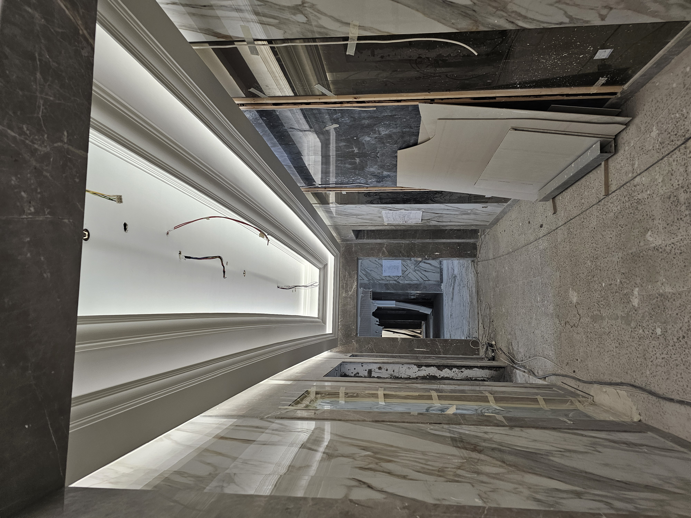

# توصيات تقنية مفصلة - Implementation Guide

## 1️⃣ حل مشكلة CSS Duplication (الأولوية القصوى)

### المشكلة الحالية:
```
showroom.html: 900+ سطر (بما فيه 400+ CSS مكرر)
villa.html: 850+ سطر (نفس المحتوى CSS)
6-towers.html: 850+ سطر (نفس المحتوى CSS)
36-towers.html: 850+ سطر (نفس المحتوى CSS)
```

### الحل المقترح - استخراج shared styles:

#### أولاً: إنشاء `assets/css/pages.css`
```css
/* ============================================================
   PROJECT PAGES — SHARED STYLES
   ============================================================ */

/* Back navigation bar */
.back-bar {
  display: flex;
  align-items: center;
  gap: 10px;
  margin-bottom: 36px;
}

.back-link {
  display: inline-flex;
  align-items: center;
  gap: 7px;
  font-family: var(--label);
  font-size: 12px;
  letter-spacing: 0.12em;
  text-transform: uppercase;
  color: var(--muted);
  transition: color 0.18s;
}

.back-link:hover {
  color: var(--white);
}

.back-link svg {
  width: 14px;
  height: 14px;
  flex-shrink: 0;
}

/* Type badge */
.type-badge {
  font-family: var(--label);
  font-size: 11px;
  letter-spacing: 0.14em;
  text-transform: uppercase;
  color: var(--gold);
  border: 1px solid rgba(201, 168, 76, 0.35);
  border-radius: 999px;
  padding: 3px 11px;
}

/* Project hero section */
.proj-hero {
  display: grid;
  grid-template-columns: 1fr 1fr;
  gap: 32px;
  align-items: start;
  margin-bottom: 56px;
}

.proj-eyebrow {
  font-family: var(--label);
  font-size: 11px;
  letter-spacing: 0.18em;
  text-transform: uppercase;
  color: var(--muted);
  margin-bottom: 10px;
}

.proj-title {
  font-family: var(--serif);
  font-size: clamp(32px, 5vw, 52px);
  line-height: 1.08;
  margin-bottom: 14px;
  color: var(--white);
}

.proj-title em {
  font-style: italic;
  color: var(--gold);
}

/* Meta chips */
.meta-chip {
  font-family: var(--label);
  font-size: 12px;
  padding: 5px 12px;
  border-radius: 999px;
  border: 1px solid rgba(255, 255, 255, 0.1);
  background: rgba(255, 255, 255, 0.04);
  color: var(--muted);
  display: inline-flex;
  align-items: center;
  gap: 6px;
}

.meta-chip.gold {
  border-color: rgba(201, 168, 76, 0.4);
  background: rgba(201, 168, 76, 0.07);
  color: var(--gold);
}

/* Metric card (Key stats) */
.metric-card {
  background: rgba(201, 168, 76, 0.06);
  border: 1px solid rgba(201, 168, 76, 0.22);
  border-radius: 18px;
  padding: 28px 26px;
  display: flex;
  flex-direction: column;
  gap: 8px;
}

.metric-label {
  font-family: var(--label);
  font-size: 11px;
  letter-spacing: 0.16em;
  text-transform: uppercase;
  color: var(--gold);
}

.metric-value {
  font-family: var(--serif);
  font-size: clamp(36px, 6vw, 56px);
  line-height: 1;
  color: var(--gold);
}

.metric-sub {
  font-size: 13px;
  color: var(--muted);
  line-height: 1.55;
}

/* Responsive adjustments */
@media (max-width: 900px) {
  .proj-hero {
    grid-template-columns: 1fr;
    margin-bottom: 48px;
  }
}

@media (max-width: 700px) {
  .back-bar {
    margin-bottom: 28px;
  }
  
  .proj-title {
    font-size: clamp(24px, 4vw, 40px);
  }
}
```

#### ثانياً: تحديث `projects/showroom.html`
```html
<!-- Add to <head> after style.css -->
<link rel="stylesheet" href="../assets/css/pages.css" />

<!-- Remove all page-specific <style> tags -->
<!-- Keep only page-unique content -->
```

**نتيجة التحسين:**
- تقليل حجم showroom.html من 900 → 350 سطر
- تقليل حجم villa.html من 850 → 300 سطر
- تقليل حجم 6-towers.html من 850 → 300 سطر
- تقليل حجم 36-towers.html من 850 → 300 سطر
- **المجموع: 1,250 سطر محفوظة** ✓

---

## 2️⃣ تحسين صور وأداء الموقع

### المشكلة الحالية:
```
❌ hero-profile.png: ~500KB (PNG - حجم كبير)
❌ معظم الصور JPG بدون compression
❌ الصور بدون responsive sizing
❌ استهلاك كبير للبيانات على الموبايل
```

### الحل المقترح:

#### أولاً: تحويل الصور إلى WebP
```bash
# استخدام ImageMagick أو FFmpeg
magick convert assets/images/hero-profile.png -quality 80 assets/images/hero-profile.webp
magick convert assets/images/villa-hero.jpg -quality 75 assets/images/villa-hero.webp
```

#### ثانياً: استخدام <picture> element
```html
<!-- الحالي (مشكلة): -->


<!-- الحل المقترح: -->
<picture>
  <source srcset="assets/images/hero-profile.webp" type="image/webp" />
  <source srcset="assets/images/hero-profile-small.webp 640w,
                  assets/images/hero-profile.webp 1080w" 
          type="image/webp" />
  <source srcset="assets/images/hero-profile-small.jpg 640w,
                  assets/images/hero-profile.jpg 1080w" 
          type="image/jpeg" />
  
</picture>
```

#### ثالثاً: إضافة image lazy loading
```html
<!-- للصور في gallery -->

```

---

## 3️⃣ إصلاح HTML Semantics

### المشكلة الحالية:
```html
<!-- غير semantic: -->
<div id="home">
  <div class="shell">
    <div class="hero">
      <div class="hero-left">
        <div class="hero-eyebrow">...</div>
        <h1>...</h1>
      </div>
    </div>
  </div>
</div>
```

### الحل المقترح:
```html
<!-- Semantic HTML5: -->
<section id="home" class="hero-section">
  <div class="container">
    <header class="hero">
      <div class="hero__content">
        <p class="hero__eyebrow">Civil / Project Engineer</p>
        <h1 class="hero__title">Mahmoud Shehata</h1>
        <p class="hero__subtitle">I don't just run sites. I recover them.</p>
      </div>
    </header>
  </div>
</section>

<!-- Project cards: -->
<section id="projects">
  <h2>Featured Projects</h2>
  <ul class="projects-grid" role="list">
    <li>
      <article class="project-card">
        <figure>
          
          <figcaption>Project name</figcaption>
        </figure>
        <h3>Project Title</h3>
        <p>Description</p>
      </article>
    </li>
  </ul>
</section>
```

---

## 4️⃣ تحسين JavaScript Performance

### المشكلة الحالية:
```javascript
// ❌ Problematic code in main.js
window.addEventListener("scroll", onScroll, { passive: true });
// ↑ يُستدعى في كل scroll event (قد يكون 60+ مرة/ثانية!)
```

### الحل المقترح:

#### إنشاء `assets/js/utils.js`:
```javascript
// Utility: Throttle function
export function throttle(fn, delay) {
  let timeoutId = null;
  let lastExecTime = 0;

  return function throttled(...args) {
    const now = Date.now();
    const timeSinceLastExec = now - lastExecTime;

    if (timeSinceLastExec >= delay) {
      lastExecTime = now;
      fn.apply(this, args);
    } else {
      clearTimeout(timeoutId);
      timeoutId = setTimeout(() => {
        lastExecTime = Date.now();
        fn.apply(this, args);
      }, delay - timeSinceLastExec);
    }
  };
}

// Utility: Debounce function
export function debounce(fn, delay) {
  let timeoutId;
  return function debounced(...args) {
    clearTimeout(timeoutId);
    timeoutId = setTimeout(() => fn.apply(this, args), delay);
  };
}

// Utility: Cache DOM elements
const domCache = new Map();
export function getElement(selector) {
  if (!domCache.has(selector)) {
    domCache.set(selector, document.querySelector(selector));
  }
  return domCache.get(selector);
}
```

#### تحديث `assets/js/main.js`:
```javascript
import { throttle, debounce, getElement } from './utils.js';

// Cache elements
const siteNav = getElement(".site-nav");

// Use throttle for scroll events
const handleScroll = throttle(() => {
  if (siteNav) {
    siteNav.classList.toggle("scrolled", window.scrollY > 30);
  }
}, 100);

window.addEventListener("scroll", handleScroll, { passive: true });
```

---

## 5️⃣ إضافة Missing Alt Texts

### البحث والإصلاح:
```bash
# البحث عن صور بدون alt
grep -n '


<!-- ✅ محسّن: -->

```

---

## 6️⃣ إضافة sitemap.xml و robots.txt

### إنشاء `robots.txt`:
```
User-agent: *
Allow: /
Disallow: /assets/
Disallow: /downloads/

# Crawl delay
Crawl-delay: 1

# Sitemaps
Sitemap: https://mahmoudshehata.com/sitemap.xml
```

### إنشاء `sitemap.xml`:
```xml
<?xml version="1.0" encoding="UTF-8"?>
<urlset xmlns="http://www.sitemaps.org/schemas/sitemap/0.9">
  <url>
    <loc>https://mahmoudshehata.com/</loc>
    <lastmod>2026-05-12</lastmod>
    <changefreq>weekly</changefreq>
    <priority>1.0</priority>
  </url>
  <url>
    <loc>https://mahmoudshehata.com/certificates.html</loc>
    <lastmod>2026-05-12</lastmod>
    <changefreq>monthly</changefreq>
    <priority>0.7</priority>
  </url>
  <url>
    <loc>https://mahmoudshehata.com/projects/showroom.html</loc>
    <lastmod>2026-05-12</lastmod>
    <changefreq>never</changefreq>
    <priority>0.8</priority>
  </url>
  <!-- ... more URLs ... -->
</urlset>
```

---

## 7️⃣ تحسين Accessibility

### إضافة ARIA labels:
```html
<!-- ❌ قديم: -->
<button class="nav-hamburger">
  <span></span><span></span><span></span>
</button>

<!-- ✅ محسّن: -->
<button class="nav-hamburger" 
        aria-label="Toggle navigation menu"
        aria-expanded="false"
        id="menu-button">
  <span aria-hidden="true"></span>
  <span aria-hidden="true"></span>
  <span aria-hidden="true"></span>
</button>

<!-- في JavaScript: -->
menuButton.addEventListener('click', () => {
  const isOpen = menuButton.getAttribute('aria-expanded') === 'true';
  menuButton.setAttribute('aria-expanded', !isOpen);
  drawer.setAttribute('aria-hidden', isOpen);
});
```

### إصلاح Contrast Ratios:
```css
/* الحالي - قد يكون منخفضاً: */
.muted { color: #7a8499; }  /* on #080b10 background */

/* اختبر: https://webaim.org/resources/contrastchecker/ */
/* استهدف: WCAG AA (4.5:1 للنص الصغير) */

.muted { color: #a0abbe; }  /* أفضل contrast */
```

---

## 8️⃣ إنشاء README.md للمشروع

```markdown
# Mahmoud Shehata — Portfolio Website

Professional portfolio website for Civil/Project Engineer Mahmoud Shehata.

## 📁 Project Structure

\`\`\`
V3.1/
├── index.html              # Main landing page
├── certificates.html       # Certificates page
├── projects/               # Project case studies
│   ├── showroom.html      # Baniyas Cars Showroom
│   ├── villa.html         # Private Villa
│   ├── 6-towers.html      # Kenya Towers
│   └── 36-towers.html     # Egypt Towers
├── assets/
│   ├── css/
│   │   ├── style.css      # Shared design system
│   │   └── pages.css      # Page-specific styles
│   ├── js/
│   │   ├── main.js        # Main JS
│   │   └── utils.js       # Utilities
│   └── images/
├── downloads/              # CV & Portfolio PDFs
├── robots.txt
└── sitemap.xml
\`\`\`

## 🚀 Getting Started

### Prerequisites
- Modern browser (Chrome, Firefox, Safari, Edge)
- Basic HTTP server for local testing

### Local Development
\`\`\`bash
# Using Python 3
python -m http.server 8000

# Or using Node.js http-server
npx http-server
\`\`\`

Visit: http://localhost:8000

## 🎨 Design System

### Color Tokens
- Primary: #c9a84c (Gold)
- Background: #080b10 (Dark)
- Text: #f8f9fb (White)
- Muted: #7a8499

### Typography
- Serif: DM Serif Display
- Sans: DM Sans
- Labels: Syne

## 🔍 Browser Support

| Browser | Support |
|---------|---------|
| Chrome  | Latest ✓ |
| Firefox | Latest ✓ |
| Safari  | Latest ✓ |
| Edge    | Latest ✓ |
| IE 11   | ✗ |

## 📊 Performance Targets

- Lighthouse Score: 90+
- Page Load: < 1.5s
- CLS: < 0.1
- LCP: < 2.5s
- FID: < 100ms

## 🔐 Security

- HTTPS enforced
- No tracking scripts
- Privacy-focused
- No third-party cookies

## 📝 License

© 2026 Mahmoud Shehata. All rights reserved.
```

---

## 9️⃣ Minification و Optimization

### إنشاء build script في `package.json`:
```json
{
  "name": "mahmoud-portfolio",
  "version": "3.1.0",
  "scripts": {
    "build": "npm run minify:css && npm run minify:js",
    "minify:css": "csso assets/css/style.css -o assets/css/style.min.css",
    "minify:js": "terser assets/js/main.js -o assets/js/main.min.js",
    "optimize:images": "imagemin assets/images/* --out-dir=assets/images",
    "test:lighthouse": "lighthouse https://mahmoudshehata.com --view"
  }
}
```

---

## 🔟 Future Enhancements

### Phase 2 (Next):
- [ ] Contact form with backend
- [ ] Blog/Case studies
- [ ] Video content
- [ ] Newsletter signup

### Phase 3:
- [ ] Dark mode toggle
- [ ] Multi-language support
- [ ] Project filtering
- [ ] Search functionality

---

## 📞 Contact

- WhatsApp: https://wa.me/971509952788
- Email: m@mahmoudshehata.com
- LinkedIn: https://linkedin.com/in/mahmoud-ask

---

*Last updated: May 2026*
